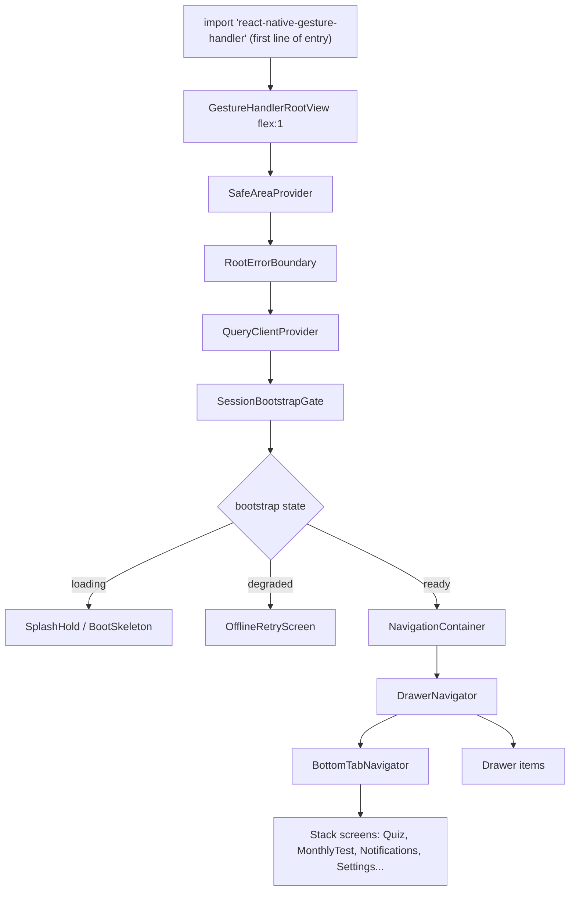
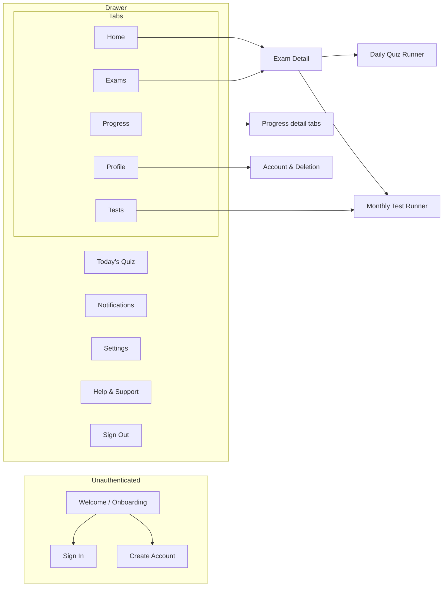
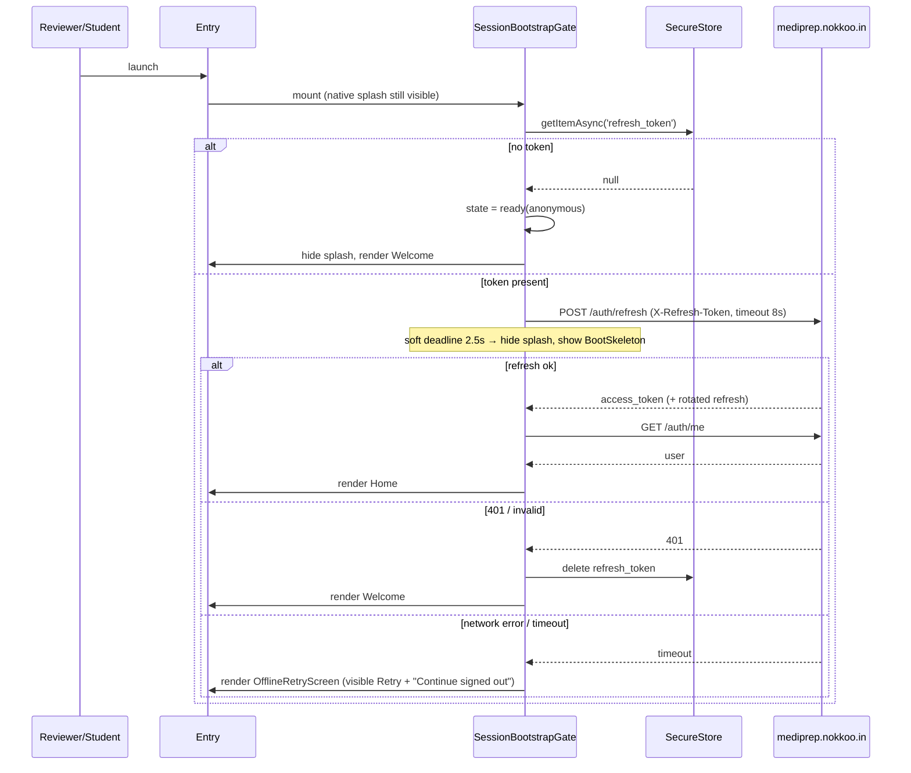
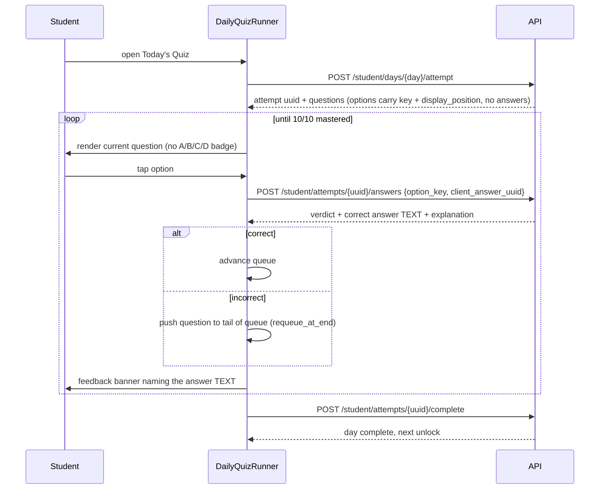
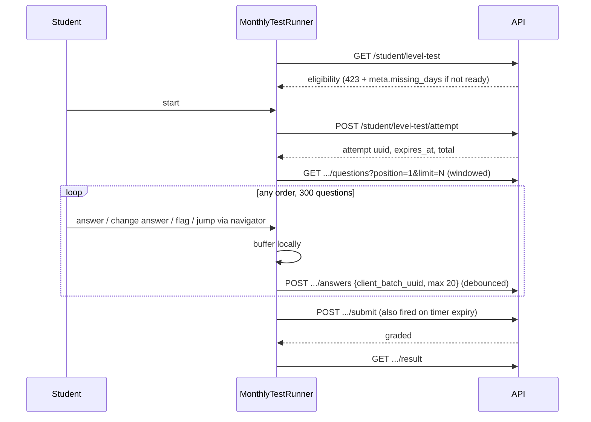
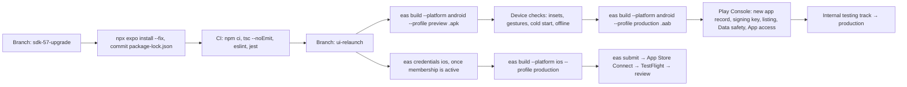

# Design Document: Mobile Store Relaunch

## Overview

ERO ships as a new application record on both stores: new package/bundle id `com.incomeinn.ero`, new
UI built from the owner's mockups, Expo SDK 52 → 57, targeting Android API 36. The old
`com.ero.quiz` listing is abandoned, not updated.

The rebuild has three independent workstreams and they fail independently, so they are designed
separately: (1) **platform correctness** — the provider tree, insets, gesture root, splash gating and
error boundary that caused the "unresponsive UI elements" rejection; (2) **content honesty** — the
mockups advertise ~148,000 questions across ten exams while the bank holds 305 FMGE questions, and
shipping the mockup numbers re-triggers the Misleading Claims policy that already produced
app-level rejections — and while the developer account's own standing is currently clean, Google's
terms still allow multiple violations to terminate an account, so each further one compounds;
(3) **store compliance** — target API, signing-key
registration, privacy policy, account deletion, Data safety, App access, icon parity.

This document also records two reversals of previously locked decisions (SDK pin, iOS scope) with
their costs, and surfaces fifteen conflicts between the mockups and either the locked decisions in
`.kiro/steering/01-locked-decisions.md` or the actual backend. None of those conflicts is resolved
silently — each has a stated V1 resolution or is listed as an owner decision.

Terminology follows steering: **level** = one month (30 daily quizzes + the month-end test),
**programme** = the 6-month container, **cycle** = one full pass. The student-facing label for a
level test is "Monthly Test". The word "course" appears nowhere.

---

## Decision reversals

Two entries in `.kiro/steering/03-mobile-eas-and-play-store.md` are reversed by this spec. They are
called out here because that file says the opposite in capital letters.

### Reversal 1 — the SDK 52 pin is lifted; we upgrade to SDK 57

Steering says: *"Expo SDK 52 — do NOT let it drift to 57"* and *"NEVER run `npx expo install --fix`"*.
That instruction existed to stop an accidental, unplanned bump on a machine with a global
`expo@57`. It is now a deliberate, planned bump on its own branch.

**Why it must happen:** Google Play requires new apps and updates to target Android 16 / API 36.
SDK 52 cannot produce an API 36 build. There is no configuration that makes SDK 52 compliant, so
the pin and store eligibility are mutually exclusive.

**What the reversal costs:**

| Cost | Detail |
|---|---|
| New Architecture becomes mandatory | SDK 55+ removed the Legacy Architecture. Any dependency without Fabric/TurboModule support is a blocker, not a warning. |
| Coordinated major bumps | `react-native-reanimated`, `react-native-screens`, `react-native-safe-area-context`, `@react-navigation/*` all move majors together. Reanimated v4 requires the New Architecture and a separate worklets package. |
| React/React Native majors | React 19 + a React Native 0.8x line. `@types/react` moves with it. Breaking changes in `StyleSheet`, `Image` and `Text` defaults are expected. |
| Edge-to-edge is no longer optional | From SDK 54 edge-to-edge is always on and cannot be opted out of. Insets handling stops being a nicety and becomes the difference between tappable and dead controls. |
| `expo-status-bar` surface change | Status/navigation bar control moves to the edge-to-edge `SystemBars` API. |
| Full re-verification | Every screen must be re-checked on device; the upgrade and the new UI must not land in one commit, or a regression cannot be attributed. |

**Constraint on how the upgrade is performed:** the exact version set is taken from the SDK 57
release notes and `npx expo install --fix` **on the upgrade branch only**, then committed via
`package-lock.json`. Versions are not hand-written into `package.json` from memory — that is how
the SDK 52/57 mixed-state breakage happened before. Any machine with a mismatched global `expo`
CLI uses `npx expo@latest` explicitly.

### Reversal 2 — iOS is in scope, and is blocked on an external dependency

Steering treats iOS as a side that "keeps failing". The failure is now understood as two separate
causes and only one of them is code: `ios.buildNumber` is absent from `app.config.ts` while
`eas.json` sets `appVersionSource: "local"`, so EAS has nothing to stamp the build with and dies
pre-compile at ~39s. That is a one-line fix in this spec.

The other cause is **not fixable in this repository**: Apple Developer Program membership is not
active. Until membership is active, no distribution certificate and no App Store provisioning
profile can be produced for `com.incomeinn.ero`, so **every iOS build fails regardless of code
quality**. The sandbox cannot perform the enrolment; the owner must.

The owner has decided on **individual enrolment**. The Play developer account type is Personal —
"Income Inn Technologies" is a display name, not a registered organisation — so organisation
enrolment was never the natural match. A **D-U-N-S number is required only for organisation
enrolment**; individual and sole-proprietor enrolment needs none, and Apple's guidance puts
confirmation in the **~24–48 hour** range.

**The tradeoff accepted, recorded so it is not mistaken for an oversight later:** under individual
enrolment the owner's **personal legal name is listed as the seller on the App Store**, not "Income
Inn Technologies". Showing the company name requires organisation enrolment, which reinstates the
D-U-N-S number and its multi-week verification. The owner chose individual enrolment deliberately
and accepts the personal-name seller listing, because the app is distributed to his own
consultancy's students rather than sold to a general market.

Consequence for planning: membership is still a genuine prerequisite — iOS cannot build without it —
but it is **no longer the multi-week critical path and no longer the longest external dependency**.

**Decision — enrolment is deliberately deferred until Android is approved and live on Google Play.**
The owner buys the membership after the Android app is fixed, submitted and approved, not before.
Three reasons, and they compound:

- The Apple Developer Program is an **annual subscription that starts counting from the date of
  purchase**. Buying it while Android work is still in progress burns paid membership on a period in
  which no iOS build can be produced anyway.
- If the Android build surfaces problems — a dependency with no New Architecture support, or another
  review rejection — the owner would rather learn that before paying.
- **This decision depends on the correction in the paragraphs above and would be wrong without it.**
  Individual enrolment confirms in roughly 24–48 hours, so there is no scheduling benefit to
  enrolling early and deferral costs nothing. Had enrolment still been the organisation path — a
  D-U-N-S number and multi-week verification — deferring would have been the wrong call, because the
  wait would have had to overlap the Android work to avoid pacing the project.

iOS stays fully in scope as a later phase; the deferral is about *when the money is spent*, not about
scope. In particular it is **not** a reason to strip iOS configuration out of branch 1: `ios.bundleIdentifier`,
`ios.buildNumber` and the explicit `ios` block in `eas.json` still land with the SDK upgrade. They
cost almost nothing, they stop the two platforms from diverging while only one is shipping, and they
mean that when membership is eventually bought, credentials are the single outstanding item.

The critical path is therefore unambiguous and single-threaded at the platform level:

```
branch sdk-57-upgrade → branches api-account-deletion + ui-relaunch → Android preview build →
manual device checklist → production .aab → Play approval
    → then Apple enrolment → iOS credentials → iOS build → App Store submission
```

---

## Identity changes

| Item | Old | New |
|---|---|---|
| Android package / iOS bundle id | `com.ero.quiz` | `com.incomeinn.ero` |
| Store name | ERO - Daily Exam Practice | ERO (tagline "Medical Learning Without Borders") |
| Developer | — | Income Inn Technologies |
| EAS project | `ero-quiz` (`6d4074a5-…`) | new project for the new slug; the stale `quizpath` comment in `app.config.ts` is deleted — steering is explicit that `quizpath` is the wrong project |
| `android.versionCode` | 8 | 1 (new package, fresh series) |
| `ios.buildNumber` | absent — root cause of the 39s failures | `'1'`, string, bumped every App Store upload |
| `version` | 1.0.7 | 1.0.0 |

**Cost of the package rename, stated plainly:** a new package is a new application record on both
stores. There is no update path from `com.ero.quiz`, no carry-over of installs, ratings or reviews,
a new upload signing key to register, a from-scratch review, and a fresh Data safety declaration and
store listing. The owner has locked this; the old package is unusable — `com.ero.quiz` was suspended
on 3 Oct 2026 and the console confirms its installs, statistics and ratings were removed, so there is
nothing left to carry over even in principle. It is recorded here so nobody later mistakes the
install count reset for a bug.

---

## Architecture

### Provider tree — the primary defect and its fix

The current `mobile/src/App.tsx` mounts `QueryClientProvider → AuthBootstrap → AppNavigator`, and
`AppNavigator` mounts `createBottomTabNavigator`. `react-native-safe-area-context` is installed but
**no `SafeAreaProvider` exists anywhere in the tree**, so `useSafeAreaInsets()` resolves to zero.
Under the enforced edge-to-edge of recent Android versions the bottom tab bar is laid out underneath
the system navigation bar: the icons are drawn, visible, and consume no touches. That is a literal
match for Google's "Unresponsive UI elements, such as buttons or icons".

Target tree, outermost first. Order is load-bearing, not stylistic:



Why each layer, and what breaks without it:

- **`import 'react-native-gesture-handler'` as the first statement of the entry file** — required on
  Android before any gesture handling initialises. Missing today.
- **`GestureHandlerRootView`** with `flex: 1` — drawer and swipe gestures silently do nothing
  without it. Missing today.
- **`SafeAreaProvider`** — the defect above. Must wrap the navigators, not sit inside a screen.
- **`RootErrorBoundary`** — today any uncaught render error yields a blank screen, which a reviewer
  reports as unresponsive. The boundary renders a visible failure with a Retry control.
- **`SessionBootstrapGate`** — replaces `if (isLoading) return null` in `AppNavigator`. Rendering
  `null` while a 15s-timeout `/auth/refresh` is in flight is a blank, touch-dead screen for up to
  15 seconds on a slow network. The gate holds the native splash, then shows a skeleton, then shows
  a retry screen — never nothing.
- **Drawer above tabs** — the mockups have both a drawer and bottom tabs. Drawer outermost so that
  drawer items can target tabs and stacks alike.

### Navigation graph



Drawer items that the mockups list but the backend cannot serve (Bookmarks) are **absent from the
drawer in V1**, not present-and-dead. A dead drawer item is the same violation class we are fixing.

### Cold start — what the reviewer sees in the first 15 seconds



Three deadlines, all explicit: splash is released by **2.5s** whatever happens; the refresh call
times out at **8s** (down from 15s); a failed bootstrap always lands on an interactive screen. There
is no code path that renders `null`.

### Daily quiz — requeue-at-end, immediate feedback, no free navigation



The runner exposes **no Previous/Next**. Progression is driven by the server verdict and the local
queue; the only controls are option taps and a Continue after feedback. `client_answer_uuid` is
generated once per question-exposure and reused on retry, so a flaky network cannot double-record.

### Monthly test — free navigation, fixed option order, 3-hour timer



Timer is derived from the server's `expires_at`, never from a client countdown started at mount —
a backgrounded app must not gain time. Option order within one attempt is fixed for the whole
attempt (ADR 003); the per-exposure guarantee comes from the retake.

---

## Root-cause remediation

Each defect, its fix, and how we know it is fixed. The verification column is what the task list
must produce; "manual" entries are device checks that cannot be automated here.

| # | Defect | Fix | Verification |
|---|---|---|---|
| 1 | No `SafeAreaProvider`; tab bar under the system nav bar, icons untappable | `SafeAreaProvider` above the navigators; tab bar height = `base + insets.bottom`; `useSafeAreaInsets` in every full-bleed screen | Component test asserting the rendered tab bar container's bottom padding equals the mocked inset; manual tap test on an Android 15/16 emulator with gesture nav and with 3-button nav |
| 2 | No `GestureHandlerRootView`, no top-level gesture-handler import | Add both; import is the first statement of the entry module | Lint rule / test asserting entry module's first import; manual drawer swipe |
| 3 | `if (isLoading) return null` + 15s axios timeout = blank dead screen | `SessionBootstrapGate` with 2.5s splash release, 8s request timeout, explicit degraded state | Test: with a never-resolving refresh mock, a visible retry affordance is on screen after the soft deadline |
| 4 | No error boundary — any JS throw is a blank screen | `RootErrorBoundary` + fallback with Retry; global handler logs | Test: a child that throws renders the fallback, not an empty tree |
| 5 | Everything behind `LoginScreen`; reviewer with bad credentials sees a failed `Alert` only | App access demo credentials in Play Console and App Store Connect review notes, against a seeded mid-programme demo student (guest mode decided against — see the guest-mode decision below) | Manual: fresh install, demo credentials reach Home |
| 6 | `device_name: 'ios'` hardcoded on Android | `device_name` = `${Platform.OS} ${Device.modelName ?? 'device'}`; backend already accepts it optionally on login and register | Unit test over a mocked `Platform.OS` matrix |
| 7 | No `ios.buildNumber` with `appVersionSource: "local"` → iOS dies at ~39s | Add `ios.buildNumber: '1'`; bump per upload | Config test asserting both `android.versionCode` and `ios.buildNumber` are present |
| 8 | No `mobile/package-lock.json`; EAS `npm ci` fails at "Install dependencies" | Generate on the upgrade branch and commit; CI fails if it is missing or out of sync | CI step: `npm ci` in `mobile/` |
| 9 | Stale `app.config.ts` comment naming the EAS project `quizpath` | Delete; comment names the real project and explains the local-versioning rule | Review |

---

## Components and interfaces

TypeScript throughout — the existing app is TypeScript and the stack (Expo/React Native) fixes the
language. Design tokens continue to come from `mobile/src/theme.ts`, which already carries the
mockup palette (`bg #0a0e1a`, `bgCard #0f1830`, primary `#2563eb`); the mockup base `#0B1120` is
reconciled to the existing `bg`/`bgCard` tokens rather than adding a fourth near-navy. Screens stop
hardcoding hex values.

### SessionBootstrapGate

```typescript
type BootstrapState =
  | { status: 'loading' }
  | { status: 'ready'; user: User | null }      // null = anonymous, not an error
  | { status: 'degraded'; reason: 'network' | 'server'; retry: () => void };

interface SessionBootstrapGateProps {
  children: React.ReactNode;
  softSplashDeadlineMs?: number;   // default 2500 — splash released regardless of progress
  requestTimeoutMs?: number;       // default 8000 — was 15000
}
```

**Preconditions:** mounted inside `QueryClientProvider`; `expo-splash-screen` auto-hide has been
prevented at module scope.

**Postconditions:** the native splash is hidden within `softSplashDeadlineMs` of mount in every
branch; exactly one of a skeleton, a degraded screen, or the navigator is on screen at all times;
no branch returns `null`; on a 401 the stored refresh token is deleted before rendering Welcome.

### RootErrorBoundary

```typescript
interface RootErrorBoundaryProps { children: React.ReactNode; onError?: (e: Error, info: React.ErrorInfo) => void }
interface RootErrorBoundaryState { error: Error | null }
```

**Postconditions:** when a descendant throws during render, the fallback is rendered with at least
one enabled, hit-testable control; Retry resets `error` to `null` and remounts the subtree.

### Safe-area-aware chrome

```typescript
/** Single source of truth for bottom chrome height. Used by the tab bar and by any
 *  screen with a pinned footer (quiz toolbar, test submit bar). */
function useBottomChromeHeight(base: number): number;   // base + insets.bottom

/** Screens that draw to the edges call this rather than reading insets ad hoc,
 *  so one component owns the edge-to-edge contract. */
function useScreenPadding(): { paddingTop: number; paddingBottom: number };
```

**Invariant:** for every mounted screen, every interactive element's hit rect lies strictly inside
the safe area, i.e. `elementBottom <= screenHeight - insets.bottom`.

### Exam catalogue — the content-honesty boundary

The catalogue is the single place where exam marketing copy lives, and the only place a question
count may appear. Everything else reads from it.

```typescript
type ExamAvailability = 'live' | 'coming_soon';

interface ExamCatalogueEntry {
  key: 'fmge' | 'usmle' | 'plab' | 'amc' | 'mccqe' | 'russian' | 'vietnam' | 'uzbekistan' | /* ... */ string;
  label: string;                 // "FMGE"
  accentColor: string;           // per-exam accent from theme tokens
  heroImage: ImageSourcePropType;
  availability: ExamAvailability;
  /** Present ONLY when availability === 'live', and ONLY ever sourced from the API
   *  (exam_categories/programmes), never from a literal in this file. */
  stats?: { questionCount: number; levelCount: number };
}
```

**Type-level enforcement of the owner's locked decision:**

```typescript
type ComingSoonExam = ExamCatalogueEntry & { availability: 'coming_soon'; stats?: never };
type LiveExam       = ExamCatalogueEntry & { availability: 'live'; stats: { questionCount: number; levelCount: number } };
export type Exam = LiveExam | ComingSoonExam;
```

`stats?: never` makes "USMLE 30,000+" a compile error rather than a policy incident. A
`coming_soon` tile renders the label, the accent, the artwork and the words "Coming soon" — it is
**not tappable into a catalogue**, because a browsable catalogue of exams with no content is both a
dead end and a misleading claim. V1: FMGE is the only `live` entry, and its counts come from the
API, not from the mockup.

### API layer

The existing `mobile/src/api/client.ts` single-flight refresh queue is sound and is kept. Changes:

```typescript
// client.ts
const REQUEST_TIMEOUT_MS = 8_000;            // was 15_000

/** Narrowed from the documented error-code table so screens switch exhaustively. */
type ApiErrorCode =
  | 'ONBOARDING_REQUIRED' | 'ENROLMENT_INACTIVE'
  | 'QUIZ_DAY_LOCKED' | 'QUIZ_NOT_COMPLETE'
  | 'LEVEL_TEST_NOT_ELIGIBLE' | 'TEST_ATTEMPT_CLOSED' | 'TEST_ATTEMPT_EXPIRED'
  | 'LEVEL_ADVANCE_NOT_ALLOWED' | 'ATTEMPT_ALREADY_COMPLETED';

interface ApiEnvelope<T> { success: boolean; message: string; data: T; errors?: { code?: ApiErrorCode }; meta?: Record<string, unknown> }
```

One addition: a `device_name` helper, and a rule that **no screen builds a URL string** — all paths
live in one `endpoints.ts` keyed to `docs/phase-3/student-api.md`.

### Question rendering — no option letters

```typescript
interface DeliveredOption {
  key: string;              // canonical key — ALWAYS what gets submitted
  text: string;
  displayPosition: number;  // render order only; carries no meaning across exposures
  imagePath?: string | null;
}

interface OptionTileProps {
  option: DeliveredOption;
  state: 'idle' | 'selected' | 'correct' | 'incorrect';
  onPress: (key: string) => void;
}
```

**Invariants:** no letter, index or ordinal is rendered on an option tile; every tile exposes an
identical set of visual affordances in the `idle` state (a tile that is shaped differently is an
answer key); feedback copy interpolates `option.text`, never a letter or a position.

```typescript
/** The only sanctioned way to build feedback copy. There is deliberately no
 *  overload that takes a letter or an index. */
function feedbackCopy(verdict: 'correct' | 'incorrect', correctAnswerText: string): string;
```

This is ADR 003 enforced in the type system: option order moves on every exposure, so a letter is
not merely redundant, it is false. It also contains the known content problem that ~50 existing
explanations say "option B is correct" — the explanation body is rendered as supplied, and that
defect is flagged to the owner as a content fix (steering open question 2), not papered over by the
client.

### Daily quiz queue (pure, and therefore testable)

```typescript
interface QueueState { pending: number[]; current: number | null; mastered: Set<number>; exposures: Map<number, number> }

function advance(state: QueueState, questionId: number, verdict: 'correct' | 'incorrect'): QueueState;
```

**Preconditions:** `questionId === state.current`; `questionId` is not already in `state.mastered`.

**Postconditions:** on `correct`, `questionId ∈ mastered'` and `questionId ∉ pending'`; on
`incorrect`, `questionId` is the **last** element of `pending'` and `mastered' === mastered`; in both
cases `exposures'(questionId) === exposures(questionId) + 1`; `current'` is `pending'[0]` or `null`
when `pending'` is empty; `mastered' ∪ pending' ∪ {current'}` always equals the original
question set — nothing is lost and nothing is invented. A wrong answer never decrements anything:
there are no negative marks anywhere in this model.

### Monthly test timer

```typescript
/** Derived from the server's expires_at. There is no API that accepts a duration,
 *  because a client-side countdown restarts when the app is backgrounded. */
function useAttemptDeadline(expiresAtIso: string): { remainingMs: number; expired: boolean };
```

**Postconditions:** `remainingMs` is a function of `expiresAt - Date.now()` only; on
`expired === true` the runner submits exactly once (idempotent endpoint, but the client also
latches); returning from background recomputes rather than resumes.

---

## Data models

Client types mirror the documented API payloads. No client-side progression logic: the dashboard's
primary action is rendered from the server's `next_action`, per `docs/phase-3/student-api.md`.

```typescript
type NextAction =
  | 'start_day' | 'resume_day' | 'locked'
  | 'take_level_test' | 'retake_level_test'
  | 'advance_level' | 'programme_complete';

interface DashboardPayload {
  nextAction: NextAction;
  level: { number: number; title: string };     // "Level 3" = month 3. Never "course".
  day: { number: number; total: 30 };
  stats: { overallAccuracy: number; questionsAnswered: number; daysCompleted: number; currentStreak: number };
  unlockHint?: string;                          // server-authored copy for locked states
}

interface LevelTestSummary {
  eligible: boolean;
  missingDays?: number[];        // from meta.missing_days on a 423
  durationMinutes: 180;          // 3 hours — kept, unlike the daily quiz
  totalQuestions: number;
  attempts: Array<{ uuid: string; submittedAt: string; score?: number }>;
}
```

**Validation rules.** `stats.overallAccuracy` is clamped to `0..100` for rendering; absent stats
render as "—", never as `0` (a fabricated zero is wrong, and "0% accuracy" to a new student is
worse than blank). `day.total` is read from the payload, not assumed. Locked-state copy comes from
`unlockHint` so that unlock semantics live on the server, where the timezone rules are already
correct — steering records that computing calendar days client-side is a standing trap for Indian
students on a UTC server.

---

## Mockup ↔ reality conflicts

Every conflict found, with a V1 resolution. Three are owner decisions, not ours.

| # | Mockup element | Conflicts with | V1 resolution |
|---|---|---|---|
| 1 | ~148,000 questions, ten exams with counts | 305 real FMGE questions; Misleading Claims policy already cited | **Owner-locked:** FMGE only with real counts; others render "Coming soon", no counts, no catalogue. Enforced by the `stats?: never` type above. |
| 2 | A/B/C/D option badges | ADR 003 per-exposure shuffling; ~50 explanations name letters | **Owner-locked:** badges dropped entirely; feedback names answer text. |
| 3 | Timer on every quiz | 10-of-10 required, unlimited attempts, no negative marking | **Owner-locked:** no timer on the daily quiz; 3-hour timer retained on the monthly test. |
| 4 | Previous/Next on the quiz screen | `retry_mode = requeue_at_end` — the gap between a miss and the retry is the mechanism | Daily quiz has no free navigation; monthly test has full free navigation + navigator grid. |
| 5 | "Subjects" tab on exam detail; "Subject-wise" progress tab | No subjects table. Questions carry free-text `questions.topic` + `tags` json and are scoped to `level_id`, not to a subject | V1 ships **Topic-wise** only, from the existing per-topic breakdown on `/student/progress`. The Subjects tab and the Subject-wise progress tab are **not rendered** in V1. Subject-wise needs new schema + endpoints → V2. |
| 6 | "Previous Papers" tab and feature icon | No previous-paper entity. Paper provenance exists only as free-text `questions.source` ("Dec 2019", "Jan 2024") and nothing exposes it | **Decided — tab dropped in V1.** The recommendation stands unoverridden: a Previous Papers tab with nothing behind it is the dead-control violation we are fixing. The onboarding feature icon may stay **only** with copy honest about what it means ("Built from real FMGE papers" — true, since all 305 questions come from the Dec 2019 and Jan 2024 papers); it must not imply a browsable paper archive. Revisitable once paper provenance is modelled (a `papers` entity or a structured `source`) and an endpoint exposes it → V2. |
| 7 | "65 Your Rank" | No rank/leaderboard anywhere in the backend | Not rendered. V2 — and worth a separate decision, since ranking 1 enrolled cohort is meaningless until there is volume. |
| 8 | Bookmarks (profile item + drawer item) | No bookmarks table | Not rendered in V1. V2. |
| 9 | Notes + Report in the quiz toolbar | No notes, no report/flag-content endpoint | Not rendered in V1. V2. |
| 10 | Flag in the quiz toolbar | Partially exists — the monthly test has flagging (`/level-test/.../navigator` returns an answered/flagged grid); the daily quiz does not | **Flag shown on the monthly test only.** The daily quiz toolbar carries Calculator alone. A control that works on one screen and not another is defensible; a control that works nowhere is not. |
| 11 | Calculator in the quiz toolbar | None — purely client-side | Ships. Cheap, and it is the one toolbar item with no backend dependency. |
| 12 | "Key Points" / "High-Yield Fact" as separate blocks | `questions.explanation` is one `text` column | Single explanation block in V1. Also: 247 of 305 questions have **no** explanation, so the block must have a defined empty state rather than rendering an empty card. Splitting into typed blocks needs schema work → V2. |
| 13 | "Continue with Google" / "Continue with Apple" | Sanctum email/password only | Buttons **removed**, not disabled. Note for iOS: Apple's Sign in with Apple requirement is triggered by offering *other* third-party logins — offering none avoids it entirely, so removing both is also the cheaper App Review path. |
| 14 | "Choose Your Exam" grid implying multiple concurrent enrolments | Onboarding enrols in one exam + programme; multi-enrolment is unverified | V1 treats the grid as selection-then-enrolment, with one active programme. "My Exams" lists the enrolled programme only. Flagged: if the owner wants concurrent enrolments, that is a backend question, not a UI one. |
| 15 | Notification bell with unread badge | `/student/notifications/unread-count` exists, **but** `PushSubscriptionController::store` hardcodes `PushTransport::WebPush` and requires `keys.p256dh`/`keys.auth` — an Expo push token cannot register | In-app notification list and badge ship against the existing endpoint. **Actual push delivery needs backend work** (below). Until then the app does not ask for notification permission, because prompting for a permission it cannot use is a worse first impression than not prompting. |
| 16 | Progress "trend chart" | `/student/progress` payload shape not verified to include a time series | Verify first. If no series exists, V1 renders the accuracy ring + per-topic bars and the trend chart is dropped rather than filled with synthesised points. |

Vocabulary reconciliation: the mockups say "Monthly Test" and "Mock Tests"; the domain says
`level_test`. UI uses **Monthly Test** consistently (including the Tests tab and the drawer item —
"Mock Tests" is dropped, because these are not mocks, they are the level's own 300 questions
reshuffled). Locked copy for a locked month reads from the server's unlock hint, which the mockup
renders as "Complete Month N".

---

## Backend work this spec depends on

Two items are not in `mobile/`. The first is not optional.

### 1. Account deletion — store-blocking on both platforms

Both stores require account deletion from inside the app **and** at a publicly reachable URL, for any
app with accounts. `docs/phase-1/08-security-architecture.md` already designs it
(`POST /student/account/delete-request` → queued anonymisation: name → "Deleted user", email →
`deleted+{uuid}@invalid`, phone/avatar nulled, push subscriptions/notifications/onboarding deleted,
attempt rows retained anonymised for aggregate integrity). **The route does not exist** — it is
absent from `api/routes/api/v1/`. It must be implemented, plus a public web page (e.g.
`https://mediprep.nokkoo.in/account-deletion`) describing what is deleted, what is retained and the
retention period, and the in-app path under Profile → Account.

### 2. Expo push transport

`PushTransport` already has an `Expo` case, so the data model anticipated this, but the controller
hardcodes `WebPush` and validates web-push key material. Registering an Expo token needs a transport
branch and a sender. Scope decision: **in-app notifications ship in V1; remote push is deferred**
unless the owner wants it, because it also needs FCM credentials on EAS, an APNs key (blocked on
Apple membership), and `POST_NOTIFICATIONS` runtime permission handling on Android 13+.

---

## Decision — guest mode: demo credentials only

**Resolved by the owner: Option B.** The "Skip →" affordance from the onboarding mockup is
**removed from V1**. There is no unauthenticated preview. Review access on both platforms relies on
a **seeded mid-programme demo student**, supplied through Play Console's **App access** section and
App Store Connect's **review notes**.

The reasoning that made it the right call:

- **Demo credentials are a store requirement either way.** They were never an alternative to a guest
  preview — both stores ask for review access to anything behind a login. So the only real question
  was whether a guest preview was worth building *on top of* credentials that must exist regardless.
- **A mid-programme demo account shows a reviewer more of the app than a guest preview would.** A
  guest sample is a handful of questions; a seeded student mid-level has a populated dashboard, a
  streak, progress, mistakes and a reachable monthly test.
- **The rejected option carried the system's only unauthenticated path into the question bank.** A
  public sample endpoint would have been the single highest-risk addition in this spec: it would have
  had to route through `QuestionDeliveryService` (locked decision 10 — never a second transformer),
  carry its own throttle, serve a fixed curated set rather than a random draw to avoid becoming a
  scrape of the bank, and carry a test proving no answer column is selected. None of that risk is now
  taken.

**The cost we accept:** no public preview for ordinary users, and the demo account becomes an
operational dependency — it must stay alive and mid-programme, because if its enrolment goes stale
review fails for a reason that looks like a bug. Hence the seed is reproducible and is re-verified
before each submission rather than created once by hand.

---

## Store compliance

### Android / Google Play

| Requirement | Design response |
|---|---|
| Target API 36 | Delivered by the SDK 57 upgrade. Verify the merged manifest's `targetSdkVersion` in the build output, not in config alone. |
| App signing key registration | There is a *"[Final reminder] Register your apps and signing keys"* notice dated 31 Aug. The new package is a new app record with a new EAS-managed upload key — register it at creation, before the first upload, and complete developer verification. |
| High-res icon parity | Cited **five times** (`HI_RES_ICON`). One master asset produces `icon.png`, `android.adaptiveIcon.foregroundImage`, and the 512×512 store icon. The installed icon and the listing icon must be visibly identical — the previous failure was a blue blob baked into the `.aab` while the listing showed the chrome ERO mark. Icon changes require a **new build**; they cannot be fixed from Play Console. |
| `IN_APP_EXPERIENCE` (3 notices) | Addressed by the same icon/name parity work plus the remediation table: the in-app experience must match the listing in name, icon and claimed content — which is also why the ~148,000-question copy cannot ship. |
| `PRIVACY_POLICY` (2 notices) | Public privacy policy URL, reachable without login, listed in the store listing *and* linked in-app under Settings. Must describe the data the app actually collects (email, name, timezone, device label, quiz activity) and the deletion path. |
| Data safety declaration | Derived from the real collection set, not from a template. Account data + app activity, tied to identity, not shared with third parties, deletion available. Must stay consistent with the privacy policy or it is itself a violation. |
| App access | Demo credentials for a seeded mid-programme student — the sole review-access mechanism, since guest mode was decided against. |
| Broken functionality | The nine remediation items, with the inset fix verified on Android 15/16 under both gesture and 3-button navigation. |
| `POST_NOTIFICATIONS` | `expo-notifications` triggers a runtime permission on Android 13+. V1 does not request it (no working push transport). When push lands, request it in-context after a value moment, never at cold start, and keep the app fully usable on denial. |
| `package-lock.json` | Committed. `npm ci` in `mobile/` runs in CI so this cannot regress. |
| Account deletion | In-app + public URL (backend work above). |
| 12-tester closed testing | **Does not apply.** Google imposes the 12-testers-for-14-days closed test on personal developer accounts *created after 13 November 2023*. This account carries enforcement entries dated August 2023, so it predates the cutoff and is exempt. Recorded explicitly because it removes two weeks a reader would otherwise budget for, and because the question would otherwise be re-derived from scratch. Confirm before relying on it by checking that the Production page displays no testing requirement. |

**Account standing, checked rather than assumed.** Play Console's account-level Policy status page
reports *"No issues found with your developer account. There may still be issues with individual
apps."* App-level enforcement has not aggregated into account-level action, so the second app,
**FAST MARRIAGE**, and its own policy notices are **not a blocker for the ERO submission**. Tidying
or unpublishing it is optional housekeeping with no deadline attached to this release.

The measured caution that remains: standing is clean *now*, and Google's enforcement terms still
provide that multiple violations may terminate an account, so every further violation compounds
against it. That is the reason Requirements 17 and 18 are written as tightly as they are — ordinary
care on a clean account, not a rescue operation.

**Decision — the existing app records stay in the console.** The owner wants none of the previously
listed apps on the Play Store, and none of them is publicly available: every record sits in
"Removed by Google", "Suspended by Google" or "Unpublished". Self-service deletion is narrower than
it looks — Google requires that an app be unpublished, have no changes in review, sit on fewer than
100 active devices, and **not be rejected, blocked or suspended**, with monetised apps that have
installs excluded entirely and needing a support ticket. That rules out `com.ero.quiz` (suspended)
and every "Removed by Google" record, leaving only the two "Unpublished" apps as candidates.
**They are left in place.** Deleting a record does not erase enforcement history, account standing is
already clean, and dead console records have no bearing on the new `com.incomeinn.ero` submission.
One specific thing must *not* be done in pursuit of tidiness: do **not** send FAST MARRIAGE's pending
changes for review to clear its "changes in review" state and make it deletable. That resubmits an
app carrying an unresolved Age-Restricted Content violation and risks a fresh strike for a cosmetic
gain. The only tidying worth doing is confirming that nothing remains published.

### iOS / App Store

| Requirement | Design response |
|---|---|
| Developer Program membership | **Blocking and external, but fast — and deliberately deferred.** No certificate, no provisioning profile, no build without it. The owner is taking **individual** enrolment: no D-U-N-S number, ~24–48 hours to confirm. The accepted cost is that the seller shown on the App Store is the owner's personal legal name, not "Income Inn Technologies". **Purchased only after the Android release is approved and live on Google Play** — the membership is an annual subscription counting from the purchase date, and a 24–48 hour confirmation means deferring costs no schedule. |
| `ios.buildNumber` | Added as a string, bumped per upload, consistent with `appVersionSource: "local"`. This is the ~39s failure. |
| Bundle id | `com.incomeinn.ero`, matching Android. |
| Account deletion | Same requirement as Play, same implementation. |
| Sign in with Apple | Not triggered, because no third-party login is offered (conflict 13). |
| Privacy manifest / App Privacy | Declared from the same real collection set as Data safety. |
| Review notes | Demo credentials; a note that content is FMGE-only at launch; a note on what "Coming soon" tiles are. |
| `eas.json` production profile | Currently configures only `android`. Add an explicit `ios` block so distribution is not relying on defaults. |

### Release pipeline



The SDK upgrade and the UI relaunch are **separate branches and separate PRs**. Steering requires
branch-and-PR with no direct pushes to `main`, and merging an SDK major together with a full UI
rewrite makes any regression unattributable.

---

## Error handling

| Condition | Code / status | UI |
|---|---|---|
| No enrolment | `ONBOARDING_REQUIRED` 403 | Route to onboarding. Not an error toast — it is a state. |
| Enrolment unusable | `ENROLMENT_INACTIVE` 403 | Support screen with contact; no retry loop. |
| Day not reached | `QUIZ_DAY_LOCKED` 423 | Locked card rendering `meta.unlock_hint` verbatim. |
| Day not finished | `QUIZ_NOT_COMPLETE` 422 | Return the student to the outstanding questions from `meta.outstanding_question_ids`. |
| Test not eligible | `LEVEL_TEST_NOT_ELIGIBLE` 423 | "Complete Month N" card listing `meta.missing_days`. |
| Test already submitted | `TEST_ATTEMPT_CLOSED` 409 | Fetch and show the result; never treat as failure. |
| Time up | `TEST_ATTEMPT_EXPIRED` 409 | Fetch the result — the server graded what arrived. |
| Cannot advance | `LEVEL_ADVANCE_NOT_ALLOWED` 423 | Disabled advance with the server's reason. |
| Answer into a finished attempt | `ATTEMPT_ALREADY_COMPLETED` 409 | Treat as success-equivalent: show the completed state. |
| 401 mid-session | — | Single-flight refresh (already implemented); on failure, clear SecureStore and route to Welcome with a "session expired" notice, not a blank screen. |
| 423 generally | 423 | **Never** rendered as "not allowed". 423 means "not yet" — the distinction is deliberate in the API and must survive into the copy. |
| Network unreachable | — | Inline retry on the affected surface; the app shell stays interactive. |
| Uncaught JS error | — | `RootErrorBoundary` fallback with Retry. |

Nothing cached that must not be: verdicts and results are `no-store` server-side, and React Query
must not persist them. `staleTime` on verdict/result queries is `0` and they are never written to any
offline cache.

---

## Testing strategy

`mobile/` currently has no test setup. Add `jest-expo` + `@testing-library/react-native`, plus
`fast-check` for the properties below. CI runs `npm ci`, `tsc --noEmit`, `eslint`, `jest` in
`mobile/`, matching the `api/` convention of a clean static-analysis gate.

**Unit / component tests** — the specific defects: provider ordering, inset-derived chrome height
against a mocked `SafeAreaProvider`, the bootstrap gate's three deadlines with fake timers, the error
boundary fallback, `device_name` across a `Platform.OS` matrix, the config assertions
(`ios.buildNumber` and `android.versionCode` both present, package id `com.incomeinn.ero`).

**Property tests** (minimum 100 iterations each; tagged
`Feature: mobile-store-relaunch, Property N: …`) — the queue reducer, the option renderer, the
catalogue honesty guard, the deadline function. These are pure functions by design; the components
around them get example-based tests.

**Not property-tested, deliberately:** anything whose behaviour does not vary with input — EAS build
configuration, store metadata, icon assets, navigation wiring. Those get single assertions or a
manual checklist. Edge-to-edge tap behaviour on a real Android 15/16 build is a **manual device
check**; no unit test can prove a touch reaches a view behind the system navigation bar.

Test names read as claims about the product, per steering: "it keeps the tab bar above the system
navigation bar", "it never renders an empty screen while the session is bootstrapping", "it never
shows a question count for an exam that is coming soon".

---

## Correctness Properties

*A property is a characteristic or behavior that should hold true across all valid executions of a
system — essentially, a formal statement about what the system should do. Properties serve as the
bridge between human-readable specifications and machine-verifiable correctness guarantees.*

Requirement references point into [requirements.md](./requirements.md). The properties are stated
here because they constrain the design; the references were added once the requirements existed to
anchor them, and no property was renumbered or reworded in the process.

Three further invariants belong to the API side rather than the client and are therefore not in this
numbered list, but must not be lost: account deletion ignores any user identifier in the request body
(requirement 16.3), replaying the deletion request 20 times leaves state unchanged (16.8), and the
demo-student seeder is idempotent (18.2). Those follow the `api/` convention of a replay-storm test
rather than a `fast-check` property.

### Property 1: Interactive elements stay inside the safe area

*For any* set of safe-area insets and any screen dimensions, every interactive element rendered by
the app has a hit rect fully inside the safe area — in particular, bottom chrome height is always at
least `insets.bottom` greater than its content height.

**Validates: Requirements 4.2, 4.4, 4.5**

### Property 2: The session gate never renders nothing

*For any* sequence of bootstrap outcomes (token present/absent, refresh success/401/timeout/network
error) and any timing of those outcomes, at every point after the soft splash deadline the gate has
rendered at least one hit-testable element, and the native splash is hidden.

**Validates: Requirements 5.1, 5.2, 5.7, 5.8**

### Property 3: The daily queue conserves questions and never regresses mastery

*For any* initial question set and *any* sequence of verdicts, after each `advance` the union of
`mastered`, `pending` and `current` equals the initial set, `mastered` is non-decreasing, and an
incorrect verdict places the question at the tail of `pending` rather than at its head.

**Validates: Requirements 9.3, 9.4, 9.5, 9.6**

### Property 4: Completion requires every question mastered

*For any* sequence of verdicts, the runner requests completion only when `mastered` has the same
cardinality as the initial question set — the 10-of-10 gate is never satisfied by a count the client
tracks separately.

**Validates: Requirements 9.7**

### Property 5: No option letter is ever rendered or spoken

*For any* delivered question and *any* display order, the rendered option tiles contain no letter,
index or ordinal label, and *for any* verdict the feedback copy contains the correct answer's text
and no letter-style reference to an option position.

**Validates: Requirements 10.1, 10.4**

### Property 6: Idle option tiles are visually indistinguishable

*For any* delivered question, every option tile in the `idle` state exposes an identical set of
style and accessibility properties, so the correct option is not identifiable by shape, size or
label.

**Validates: Requirements 10.3**

### Property 7: Coming-soon exams never carry a question count

*For any* catalogue entry whose availability is `coming_soon`, the rendered tile contains no numeral
representing a question count and no navigation target into a question catalogue.

**Validates: Requirements 8.3, 8.4**

### Property 8: Live exam counts come from the server

*For any* live catalogue entry, the rendered question count equals the value supplied by the API for
that programme — no literal count appears in client source.

**Validates: Requirements 8.2, 8.5, 8.6**

### Property 9: The attempt deadline is a function of server time only

*For any* `expires_at` and *any* sequence of foreground/background transitions and app restarts, the
remaining time equals `expires_at − now` and is never extended by backgrounding.

**Validates: Requirements 11.3, 11.4**

### Property 10: Only the monthly test is timed

*For any* daily quiz attempt, no countdown is rendered and no submission is triggered by elapsed
time; *for any* monthly test attempt, exactly one submission is triggered when the deadline passes.

**Validates: Requirements 9.8, 11.5**

### Property 11: Retried writes carry a stable idempotency token

*For any* answer submission retried any number of times, the `client_answer_uuid` (single) or
`client_batch_uuid` (batch) sent is identical across retries, so a replay storm cannot double-record.

**Validates: Requirements 12.1, 12.2, 12.3**

### Property 12: Token refresh is single-flight

*For any* set of concurrent requests that receive a 401, exactly one refresh request is issued and
every queued request is retried with the resulting token or rejected with the refresh error.

**Validates: Requirements 13.1, 13.2, 13.3**

### Property 13: Free navigation exists only in the monthly test

*For any* daily quiz state, there is no control that moves to an arbitrary question; *for any*
monthly test state, every question index is reachable and the option order for a given question is
identical on every visit within the attempt.

**Validates: Requirements 9.9, 11.6, 11.7**

### Property 14: Rendered surfaces never invent data

*For any* payload with absent or null statistics, the rendered output shows a neutral placeholder
rather than a zero or a synthesised value.

**Validates: Requirements 14.2, 14.5, 14.7**

---

## Performance considerations

The New Architecture is a net win here but changes the risk profile: animation work moves to
Reanimated v4 on worklets, so any animation written against v3 APIs must be rewritten rather than
carried over. The monthly test is the only heavy screen — 300 questions are fetched in windows via
`position`/`limit`, the navigator grid is a separate lightweight call, and answers are debounced into
batches of at most 20. Nothing requests all 300 question bodies at once.

Images (`question_image_path` with stored `width`/`height`/`alt`) use the stored dimensions to
reserve layout space, which is why those columns exist — the same CLS protection the schema comment
describes, applied to native layout jump.

Cold start is a store-review surface, not just a UX metric: the 2.5s splash deadline and 8s request
timeout exist because a reviewer on a throttled network judged this app as unresponsive once already.

## Security considerations

Unchanged and inherited: access token in memory only, refresh token in `expo-secure-store`
(Keychain/Keystore), bearer auth, `X-Refresh-Token` header on mobile with no cookies,
`NSAllowsArbitraryLoads: false`. The client never computes correctness — verdicts come from the
server, which re-derives from `questions.correct_option`.

Two specific cautions:

1. The mistakes screen is the one place answers are legitimately shown, and only for questions with
   `wrong_count > 0`. The client must not attempt to reuse that payload shape anywhere else.
2. Account deletion is a destructive authenticated write. It must be scoped through `StudentContext`
   like every other student route, must not accept a user id from the client, and must leave attempt
   rows in place (anonymised) so that deleting an account cannot be used to rewrite aggregates.

With guest mode decided against, **every** path to a question payload stays behind
`auth:sanctum`, so the question bank has no unauthenticated surface at all.

## Dependencies

- **Expo SDK 57** with the New Architecture, plus the coordinated majors of
  `react-native-reanimated` (+ its worklets package), `react-native-screens`,
  `react-native-safe-area-context`, `@react-navigation/{native,native-stack,bottom-tabs}`, and a new
  `@react-navigation/drawer`. Exact versions are pinned from the SDK 57 release notes at upgrade
  time and committed in `package-lock.json` — not transcribed from this document.
- Retained: `@tanstack/react-query`, `zustand`, `axios`, `react-hook-form` + `zod`,
  `expo-secure-store`, `expo-constants`, `expo-device`, `expo-splash-screen`.
- Added for tests: `jest-expo`, `@testing-library/react-native`, `fast-check`.
- `expo-notifications` stays installed for the in-app list; remote push additionally needs FCM
  credentials on EAS and an APNs key (blocked on Apple membership).
- External, non-code: Apple Developer Program membership (individual enrolment — no D-U-N-S;
  **not purchased until the Android release is approved and live on Play**, since the subscription
  year starts on the purchase date and confirmation takes only ~24–48 hours), a new Play
  Console app record with developer verification and signing-key registration, a hosted privacy
  policy URL, a hosted account-deletion URL, and a seeded demo student.

## Risks

| Risk | Impact | Mitigation |
|---|---|---|
| Apple enrolment not complete | iOS cannot build at all | Accepted deliberately: enrolment is deferred until Android is approved and live, so iOS is dormant by choice rather than blocked. Individual enrolment, no D-U-N-S, ~24–48 hours, which is what makes the deferral free. iOS configuration still lands in branch 1, so membership is the only outstanding item when it is bought |
| A dependency lacks New Architecture support | SDK 57 upgrade stalls | Audit the dependency list on the upgrade branch first, before UI work begins |
| A further violation compounds against the developer account | Repeated violations may terminate the account under Google's enforcement terms | Account standing is clean today (Policy status reports no account-level issues); keep it that way through Requirements 17 and 18. FAST MARRIAGE is housekeeping, not a gate |
| Mockup copy leaks into shipped builds | Repeat Misleading Claims — a fresh violation against an account whose standing is currently clean | Type-level block (`stats?: never`) + a property test over the catalogue |
| Icon mismatch recurs | `HI_RES_ICON` was cited five times | One master asset, all targets generated from it, parity checked on an installed build before upload |
| Demo account drifts out of a reviewable state | Review fails for a non-bug | Seeded, documented, re-verified before each submission |
| SDK upgrade and UI rewrite land together | Regressions unattributable | Two branches, two PRs |
